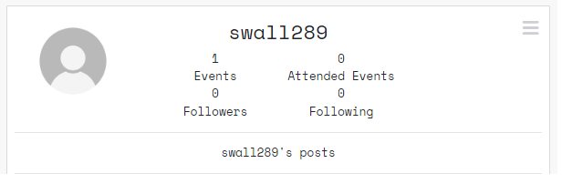
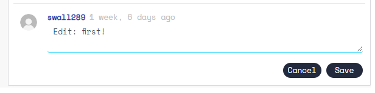
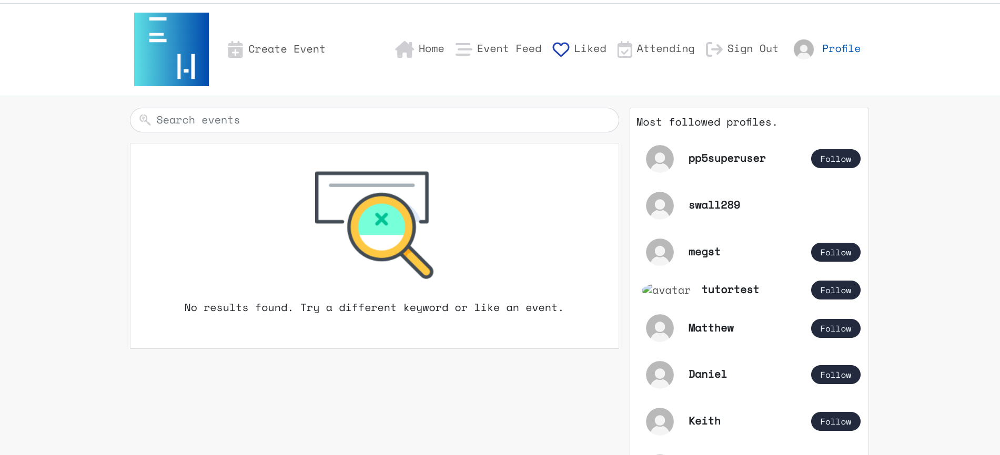
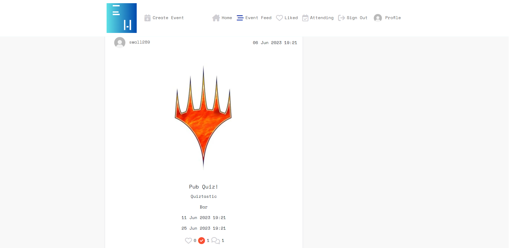
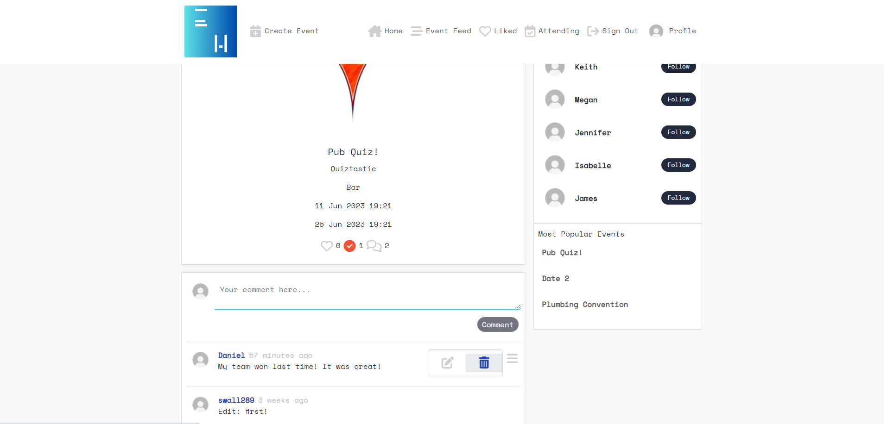
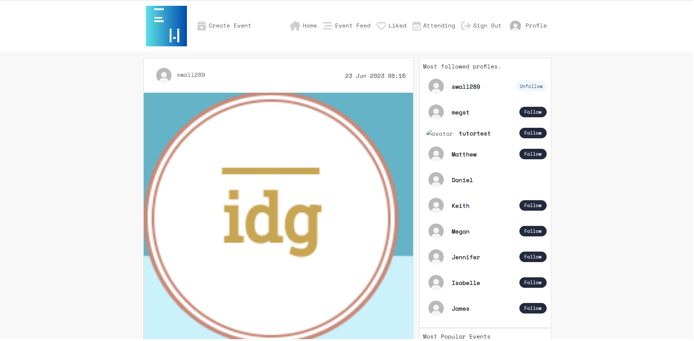

# Event Horizon
Developer: Stuart Wall

[View live website]()

## Table of Contents
  1. [About](#about)
  2. [Project Goals](#project-goals)
  3. [User Experience](#user-experience)
      1. [Target Audience](#target-audience)
      2. [User Requirements and Expectations](#user-requirements-and-expectations)
      3. [User Stories](#user-stories)
      4. [Site Owner Stories](#site-owner-stories)
  4. [Technical Design](#technical-design)
      1. [Agile Design](#agile-design)
      2. [CRUD Functionality](#crud-functionality)
      3. [Colours](#colours)
      4. [Fonts](#fonts)
      5. [Wireframes](#wireframes)
  5. [Technologies Used](#technologies-used)
      1. [Coding Languages](#coding-languages)
      2. [Frameworks and Tools](#frameworks-and-tools)
      3. [Libraries](#libraries)
  6. [Front-End](#front-end)
      1. [React](#react)
  7. [Back-End API](#back-end-api)
      1. [Django REST Framework](#django-rest-framework)
  8. [Features](#features)
  9. [Future features / improvements](#future-features--improvements)
  10. [Validation](#validation)
      1. [HTML](#html-validation)
      2. [CSS](#css-validation)
      3. [ESLint JavaScript JSX Validation](#eslint-javascript-jsx-validation)
      4. [Chrome Dev Tools Lighthouse](#chrome-dev-tools-lighthouse-validation)
      5. [WAVE Validation](#wave-validation)
  11. [Testing](#testing)
      1. [Device Testing](#device-testing)
      2. [Browser Compatibility](#browser-compatibility)
      3. [Manual Testing](#manual-testing)
  12. [Bugs](#bugs)
  13. [Deployment](#deployment)
      1. [Heroku](#heroku)
      2. [Forking GitHub Repo](#forking-the-github-repository)
      3. [Clone a GitHub Repo](#clone-a-github-repository)
  14. [Credits](#credits)
      1. [Tutorial](#tutorials)
      2. [Code](#code)
      3. [Literature](#literature)
      4. [Misc](#misc)
  15. [Acknowledgements](#acknowledgements)

## About

Event Horizon is an event hosting website. The overall concept is that users can sign up to Event Horizon and create and post events that other users can read about and attend. 

## Project Goals

The overarching project goals are to create a social media website. Users will be allowed to sign up and then log in. Once logged in, the users can edit their profile and change their username, password, profile picture and personal information. Users can also create events for other users to comment on, like or show their attendence. All posted content will have full CRUD functionality.

## User Experience

### Target Audience

The target users for Event Horizon are:
- users promoting businesses/organisations that are hosting events.
- users who wish to expand their social network and host social events in the local area.
- users who may wish to organise a specific group activity.
- users who wish to meet up with like-minded individuals.
- users who are new to an area and are looking to join local groups.

### User Requirements and Expectations

The User Requirements and Expectations of the webssite are:
- it is simple to use and intuitive to navigate.
- it is responsive across a range of devices.
- it has user authentication.
- it allows users to have their own profile page.
- it has search and filter functionality.
- it allows users to create content.
- it allows users to interact with posted content in a variety of ways.
- it has full CRUD functionality.

### User Stories

1. As a user I can view a navbar from every page so that I can navigate easily between pages.
2. As a user I can navigate through pages quickly so that I can view content seamlessly without page refresh.
3. As a user I can create a new account so that I can access all the features for signed up users.
4. As a user I can sign in to the app so that I can access functionality for logged in users.
5. As a user I can tell if I am logged in or not so that I can log in if I need to.
6. As a user I can maintain my logged-in status until I choose to log out so that my user experience is not compromised.
7. As a logged out user I can see sign in and sign up options so that I can sign in/sign up.
8. As a user I can view user's avatars so that I can easily identify users of the application.

9. As a logged in user I can create events so that I can share expand my social network.
10. As a user I can view the details of an event so that I can learn more about it.
11. As a logged in user I can like an event so that I can show my support for the creators that interest me.
12. As a logged in user I can show that I am attending and event so that I can show my support and the event host can make appropriate preparations.

13. As a user I can view all the most recent events, ordered by most recently created first so that I am up to date with the newest content.
14. As a user, I can search for events with keywords, so that I can find the events and user profiles I am most interested in.
15. As a logged in user I can view the events I liked so that I can find the events I enjoy the most.
16. As a logged in user I can view the events I am attending (or have attended) to see if there are any updates.
17. As a logged in user I can view content filtered by users I follow so that I can keep up to date with new events.
18. As a user I can keep scrolling through the images on the site, that are loaded for me automatically so that I don't have to navigate excessively throughout the site.

19. As a user I can view the event page so that I can read the comments about the event.
20. As an event creator I can edit my event details so that I can make corrections or updates to my event after it was created.
21. As a logged in user I can add comments to a event so that I can share my thoughts.
22. As a user I can see how long ago a comment was made so that I know how old a comment is.
23. As a user I can read comments on events so that I can read what other users think and see any updates.
24. As an owner of a comment I can delete my comment so that I can control removal of my comment from the application.
25. As an owner of a comment I can edit my comment so that I can fix or update my existing comment.

26. As a user I can view other users profiles so that I can see their content and learn more about them.
27. As a user I can see a list of the most followed profiles so that I can see which creators are popular.
28. As a user I can view statistics about a specific user: bio, number of events, number of events attended, followers and users followed so that I can learn more about them.
29. As a logged in user I can follow and unfollow other users so that I can see and remove events by specific users in my feed.
30. As a user I can view all the content by a specific user so that I can catch up on their latest events, or decide I want to follow them.
31. As a logged in user I can edit my profile so that I can change my profile picture and bio.
32. As a logged in user I can update my username and password so that I can change my display name and keep my profile secure.

##### Back to [top](#event-horizon)

## Technical Design

### Agile Design

An Agile approach to creating this app has been applied. GitHub's projects was used to track user stories and implement ideas based on their level of importance for allowing use of the app with no loss of functionality or user experience. 

By using AGILE methodology in this project I was able to deliver a site which had all required functionality and some more. Due to the time limit on this project I was not able to incorporate all initial listed features, but this is where an AGILE approach is great for app design. The project displays this by having User stories in the Done section and the ones which were decided to be left for future, put in the future implementations section of the readme.

The GitHub project can be found [here]()

### CRUD Functionality

Event Horizon handles data with full CRUD Functionality:
 
- Create -  Users can create an account, profile, events, comments. Users can like and attend an event and follow other users.
- Read - Users can view the events, comments, other user profiles. Users can see their likes and attending status on events and if they have followed other users.
- Update - Users can update their profile, password, hosted events, comments.
- Delete - Users can delete events and comments. They can remove likes, their attending status and unfollow users.

### Colours

The colour scheme for this application was kept minimal with a monochromatic theme kept in mind. 

Colours

### Fonts

Google Fonts were implemented on the website. 'Space Mono' with a back up of sans-serif was decided as the ideal font for the site.

### Wireframes

Balsamiq was used to create wireframes of the sites pages

Wireframes

NB - The Event Feed / Liked Feed and Attending Feed all have the same layout as the Home page that displays when a user is logged in. The Edit Event form has the same layout as the Event Creation form.

##### Back to [top](#event-horizon)

## Technologies Used

### Coding Languages

- HTML
- CSS
- Javascript
  - React (17.0.2)

### Frameworks and Tools

- [Axios](https://axios-http.com/docs/intro) - Axios is a Promise API. Justification: I used axios to send API requests from the React project to the API and avoid any CORS errors when sending cookies.
- [JWT](https://jwt.io/) - Library to decode JSON Web token. Justification: I used JWT to securely transmit data and to have the ability to verify that the content has not been tampered with.
- [React 17](https://17.reactjs.org/) - JavaScript library for building user interfaces. Justification: To be able to showcase my newly learnt skills and for building interactive user interfaces quickly.
- [React-Bootstrap 1.6.3](https://react-bootstrap-v4.netlify.app/) - CSS framework. Justification: I used Bootstrap React library for UI components, styling and responsiveness.
- [React Infinite Scroll](https://www.npmjs.com/package/react-infinite-scroll-component) - React library. Justification: I used this component to load content (tasks/comments/users) automatically as the user scrolls towards the bottom of the page without having to jump to next/previous page.
- [React Router](https://v5.reactrouter.com/web/guides/quick-start) - Javascript framework for routing. Justification: I used this library to enable navigation between views of components and to have the ability to control what is presented to the user based on the URL they have accessed in the browser. 

- [Am I Responsive](http://ami.responsivedesign.is/) - Website responsive test site. Justification: I used this to create the multi-device mock-up at the top of this README.md file
- [Balsamiq](https://balsamiq.com/) - Mock up software. Justification: I used this to create the projects wireframes
- [Chrome dev tools](https://developers.google.com/web/tools/chrome-devtools/) - Developer tool. Justification: I used this for debugging of the code and checking site for responsiveness
- [Cloudinary](https://cloudinary.com/) - File storage. Justification: I used this to store static files
- [Font Awesome](https://fontawesome.com/) - Icon library. Justification: I used this to style the site with icons.
- [Google Fonts](https://fonts.google.com/) - Font library. Justification: I used this to import fonts
- [Git](https://git-scm.com/) - Version control system. Justification: I used this for version control and to push the code to GitHub
- [GitHub](https://github.com/) - Cloud based hosting service. Justification: I used this as a remote repository to store project code
- [Gitpod](https://gitpod.io) - Cloud development environment. Justification: I used this to host a virtual workspace
- [Microsoft Paint](https://apps.microsoft.com/store/detail/paint/9PCFS5B6T72H) - Graphics editor. Justification: I used this to edit the images for testing user stories.
- Validation:
  - [WC3 Validator](https://validator.w3.org/) - HTML Validator. Justification: I used this to validate the applications HTML code
  - [Jigsaw W3 Validator](https://jigsaw.w3.org/css-validator/) - CSS Validator. Justification: I used this to validate the applications CSS code
  - [ESLint](https://eslint.org/) - JavaScript Validator. Justification: I used this to validate applications JSX code
  - [Lighthouse](https://developers.google.com/web/tools/lighthouse/) Site auditing tool. Justification: I used this to validate performance, accessibility, best practice and SEO of the application
  - [Wave](https://wave.webaim.org/) - Site accesibility auditor. Justification: I used this to evaluate the applications accessibility

### Libraries

#### Installed Libraries

| Package       | Version        |
| ------------- | ------------- |
| axios |1.3.4 |
| bootstrap | 4.6.0 |
| jwt-decode | 3.1.2 |
| react-bootstrap | 1.6.3 |
| react-dom | 17.0.2 |
| react-infinite-scroll-component |6.1.0 |
| react-router-dom | 5.3.0 |
| react-scripts | 5.0.1 |
| react-scroll | 1.8.9|

##### Back to [top](#event-horizon)

## Front-End

### React

The React.js framework is an open-source JavaScript framework and library developed by Jordan Walke, a software engineer at Meta. It's used for building interactive user interfaces and web applications quickly and efficiently with significantly less code than you would with vanilla JavaScript  

I used React for this application for several reasons:

 - Flexibility – Due to having a modular structure React code is easier to maintain compared to other front-end frameworks.

 - Speed – Creating sites/apps with React significantly increases the page loading speed as the entire page does not require to refresh and reload all components. Components are updated dynamically thus reducing the wait and load times, which affects user experience.

 - React Bootstrap - When used for styling and responsiveness React Bootstrap is a great choice as it comes with ready-to-use React built components thus taking away alot of need to create commonly used code from scratch.

- It is the most widely used library for developing social networking and media content applications - Sites such as Meta (formerly Facebook), Instagram, Netflix, Airbnb are all made with React.

- Reusability of components – Components can be created and re used throughout the app with no need to re write code for the same features.

There were various components created and reused across this application.

- `<Asset />` - multi purpose component, used to display a range of items due to being passed props. Those include a loading gif, image with source and alt attribute or a message consisting of a paragraph.

## Back-End API

### Django REST Framework

The API for this Front-End application was built with the Django REST Framework. The repository with a README file for the DRF Back-End can be found [here](https://github.com/Clinelly/ci_pp5_drf_api_events).

##### Back to [top](#event-horizon)

## Features

In its entirety the website consists of a variety of features across the many site pages as listed below.

### Home Page

The layout of the Home Page changes whether a user is logged in or not. 

Logo

Event Horizon's logo. Clicking on the logo returns the user to the home page.

NavBar

If the user is not signed in, the navbar provides links to the home page as well as sign in and sign up forms.

Carousel

If the user is not signed in, a photo carousel shows a few images and the text snippets of  the site's goals.

Footer

If the user is not signed in, a footer promotes the developer with links to LinkedIn and GitHub.

NavBar

If the user is signed in then the NavBar shows links to the various feeds of interest to the user, as well as a link to event creation and their profile.

Search Bar

If the user is signed in then the Search Bar shows, allowing users to search for events and users.

Event Summary

If the user is signed in then the Home Page shows an unfiltered list of events that have been posted to the site.

Popular Profiles

If the user is signed in then the Home Page shows a list of the 10 most followed profiles. Next to each profile is a button that allows the user to follow that specific profile. This list is repeated throughout the site on various feed pages.

Popular Profiles

If the user is signed in then the Home Page shows a list of the most attended events. This list is repeated throughout the site on various feed pages.

### Followed Feed

With a similar layout to the Home Page, this page shows a filtered list of events, posted by users that the current user has followed.

Followed Feed

In this example, there are no events shown as the user has not followed any profiles.

### Liked Feed

With a similar layout to the Home Page, this page shows a filtered list of events that have been liked by the user.

Liked Feed

In this example, there are no events shown as the user has not liked any events.

### Attending Feed

With a similar layout to the Home Page, this page shows a filtered list of events that the user has marked that they will be attending.

Attending Feed

In this example, there are no events shown as the user has not signed up to attend any events.

### Profile Page

The Profile Page shows a user's stats and posted events. If the signed in user views their own profile page, then they can edit their profile information.

Profile Stats

This section of the Profile Page shows the user's key stats.

Profile Event Summary

This section of the Profile Page shows the user's posted events.

Profile Edit Menu

If the user is viewing their own profile, this menu will provide them with options to edit their profile.

Edit Profile Image

This allows the user to upload a new image to display as their avatar.

Edit Profile Bio

This allows the user to add information to their profile.

Edit Profile UserName

This allows the user to change their username.

Edit Profile Password

This allows the user to change their password.

### Event Page

This is the page a user is taken to when they click on an event to show it in more detail.

Event Detail

This card shows the more detailed event information - Title, image, location, description, start and end times as well as number of comments, likes and attendees.

Comment Box

This form allows the user to post a comment on the current event.

Comment Feed

This displays a list of all the comments on this particular event.

Comment Feed

This displays a list of all the comments on this particular event.

Event Edit Menu

This dropdown menu provides the event ower with options to edit their event or delete it.

Comment Edit Menu

This dropdown menu provides the event ower with options to edit their comment or delete it.

Event Edit Form

Similar to the Event Creation Form, this form allows the owner of an event to change all their information.

Comment Edit Form

Similar to the Comment Creation Form, this form allows the owner of a comment to change all their information.

### Event Creation

This page is a single form which allows users to create an event with the following information: Title, image, location, description, start and end times as well as number of comments, likes and attendees.

Event Create Form

A single form which allows users to create an event with the following information: Title, image, location, description, start and end times as well as number of comments, likes and attendees.

### Authentication

Authentication is a feature of the Event Horizon website. Users will have to be authenticated whilst attempting to log in or else they will not be able to use any functionality of the site or view any information that users have posted.

Sign Up Page

A Form where users can select a username and password to create an account and access the site.

Sign In Page

A Form where signed up users can log in to the site.

## Future features / improvements

Although alot of effort was put into this project, due to time constraints there is still room for finer refactoring of code and additional functionality / features to implement to the site. 

##### Back to [top](#event-horizon)

## Validation 

### HTML Validation

The W3C Markup Validation Service was used to validate the HTML of the website. No errors were identified. There were some information tags highlighted due to the formatting of JSX components.

Main page (not logged in)
 
 

### CSS Validation

The W3C Jigsaw CSS Validation Service was used to validate the CSS of the website. All CSS modules pass the validation with no errors.

Images
 
 

 

### ESLint JavaScript JSX Validation 

All JavaScript files were validated using ESLint JavaScript validator. All files passed however there were some rules that needed to be set in the eslintrc.js file as described below:

`"rules": {
        "react/prop-types": 0,
        "react/no-children-prop": "off",
        "react/display-name": "off"
    }`

  - `"react/prop-types": 0` was used to suppress the errors relating to prop-types
  - `"react/no-children-prop": "off"` was used to suppress the errors related to the Infinit Scroll component using children={} 
  - `"react/display-name": "off"` was used to suppress the need for a component display name 

### Chrome Dev Tools Lighthouse Validation

Lighthouse was used to test the performance, accessibility, best practice and SEO of the site. The validation was done for both desktop & mobile.  

Results

Main page (not logged in)
 
 

### Wave Validation

The WAVE WebAIM web accessibility evaluation tool was used to test the websites accessibility.

Results
 

Main page (not logged in)
 
 

##### Back to [top](#event-horizon)

## Testing

### Device Testing

This site was tested on the following devices:
- ACER Chromebook 314,
- iPhone 11 Pro
- Google Pixel 7 Pro

### Browser compatibility

The website was tested on the following web browsers:
- Google Chrome
- Safari
- Microsoft Edge

 
### Manual testing

See Testing User Stories

#### Testing User Stories - Users

To avoid unnecessary repetition of images, only the feature being referred to will have screenshots. Information on how to navigate to the feature referred to will be described within its relevant table reference. 

1. As a user I can view a navbar from every page so that I can navigate easily between pages.

| Feature       | Action        | Expected Result  | Actual Result |
| ------------- | ------------- | -------------    | ------------- |
| Navbar   | Located at top of each page. Click on icon to navigate.  | Navigate to new page, navbar still present. | Works as expected. |

Images

2. As a user I can navigate through pages quickly so that I can view content seamlessly without page refresh.

| Feature       | Action        | Expected Result  | Actual Result |
| ------------- | ------------- | -------------    | ------------- |
| Navbar   | Click on each icon to naviagte to a new page.  | User navigates to new page. Page does not refresh. Spinner or content loads. | Works as expected. |

Images

3. As a user I can create a new account so that I can access all the features for signed up users.

| Feature       | Action        | Expected Result  | Actual Result |
| ------------- | ------------- | -------------    | ------------- |
| NavBar  |  Click on 'Sign Up' |  User is taken to sign up form. | Works as expected. |
| Sign Up Form  |  User fills in details and clicks sign up. |  Account created, user is directed to sign in page. | Works as expected. |

Images

4. As a user I can sign in to the app so that I can access functionality for logged in users.

| Feature       | Action        | Expected Result  | Actual Result |
| ------------- | ------------- | -------------    | ------------- |
|  Navbar    | Click on sign in tab. | User is directed to sign in page.  | Works as expected. |
|  Sign In Form    | User fills in their log in details. | User is logged in and taken to home page. | Works as expected. |

Images

5. As a user I can tell if I am logged in or not so that I can log in if I need to.

| Feature       | Action        | Expected Result  | Actual Result |
| ------------- | ------------- | -------------    | ------------- |
|  Home Page  | Non-logged in user views the page.  | Photo carousel is displayed.  | Works as expected. |
|  Navbar  | Non-logged in user views the page.  | Navbar displays sign in and sign out.  | Works as expected. |
|  Home Page  | Logged in user views the page.  | Event feed is displayed.  | Works as expected. |
|  Navbar  | Logged in user views the page.  | Navbar displays links to various feeds, profiles and event creation.  | Works as expected. |

Images

6. As a user I can maintain my logged-in status until I choose to log out so that my user experience is not compromised.

| Feature       | Action        | Expected Result  | Actual Result |
| ------------- | ------------- | -------------    | ------------- |
| Web Tokens | Web Tokens added to code.   | User is not timed out after a set period of time  | Works as expected  |

7. As a logged out user I can see sign in and sign up options so that I can sign in/sign up.

| Feature       | Action        | Expected Result  | Actual Result |
| ------------- | ------------- | -------------    | ------------- |
|  NavBar  | Non-logged in user views the page.  | Navbar displays signin/signup  | Works as expected. |

Images

8. As a user I can view user's avatars so that I can easily identify users of the application.

| Feature       | Action        | Expected Result  | Actual Result |
| ------------- | ------------- | -------------    | ------------- |
| Popular Profiles   | User views the event feeds.  | Avatar is displayed next to user name.  | Works as expected. |
| Event Preview  | User views the event feeds.  | Avatar is displayed next to creator username in the corner .  | Works as expected. |
| Event Detail  | User clicks on an event to view more details.  | Avatar is displayed next to creator username in the corner .  | Works as expected. |
| Comments  | User views the comments.  | Avatar is displayed next to commentor username .  | Works as expected. |
| NavBar   | User views the navbar.  | Avatar is displayed next to current user's profile link.  | Works as expected. |
| Profile Page   | User views their own or another profile.  | Avatar is displayed next to user's profile stats.  | Works as expected. |

Images

9. As a logged in user I can create events so that I can expand my social network.

| Feature       | Action        | Expected Result  | Actual Result |
| ------------- | ------------- | -------------    | ------------- |
|  Navbar  |  User clicks 'Create event' | User is taken to the event creation form.  | Works as expected.|
|  Event Creation Form  |  User fills in all the details and clicks 'create' | Event is created and posted to the website.  | Works as expected.|

Images

10. As a user I can view the details of an event so that I can learn more about it.

| Feature       | Action        | Expected Result  | Actual Result |
| ------------- | ------------- | -------------    | ------------- |
| Event Preview   | User views the preview on the events feed.  | Event preview displays the event information.  | Works as expected.|
| Event Detail   | User clicks on an event preview to view the event page..  | Event page displays the event information.  | Works as expected.|

Images

11. As a logged in user I can like an event so that I can show my support for the creators that interest me.

| Feature       | Action        | Expected Result  | Actual Result |
| ------------- | ------------- | -------------    | ------------- |
| Event Preview   | User views the preview on the events feed and clicks the like button.  | Like button is filled in and the like counter increases.  | Works as expected.|
| Event Detail   | User views the event page and clicks the like button.  | Like button is filled in and the like counter increases.  | Works as expected.|

Images

12. As a logged in user I can show that I am attending an event so that I can show my support and the event host can make appropriate preparations.

| Feature       | Action        | Expected Result  | Actual Result |
| ------------- | ------------- | -------------    | ------------- |
| Event Preview   | User views the preview on the events feed and clicks the 'attending' button.  | Attending button is filled in and the counter increases.  | Works as expected.|
| Event Detail   | User views the event page and clicks the attending button.  | Attending button is filled in and the counter increases.  | Works as expected.|

Images

13. As a user I can view all the most recent events, ordered by most recently created first so that I am up to date with the newest content.

| Feature       | Action        | Expected Result  | Actual Result |
| ------------- | ------------- | -------------    | ------------- |
| Home Page   | Logged in user views the home page.  | Home page displays all events, listed by most recently created.  | Works as expected. |

Images

14. As a user, I can search for events with keywords, so that I can find the events and user profiles I am most interested in.

| Feature       | Action        | Expected Result  | Actual Result |
| ------------- | ------------- | -------------    | ------------- |
| Event Feed | Navigate to any feed and view the search bar.  | Search Bar is available  | Works as expected. |
| Search Bar | User types in search parameters.  | Events are filters by keywords.  | Works as expected. |

Images

15. As a logged in user I can view the events I liked so that I can find the events I enjoy the most.

| Feature       | Action        | Expected Result  | Actual Result |
| ------------- | ------------- | -------------    | ------------- |
| Liked Feed  | Logged in user clicks on the 'Liked' feed in the NavBar  | Liked Feed shows, showing events the user has liked.  | Works as expected. |
| Event Detail | Logged in user clicks on the events shown in the liked feed.  | User is taken to the detailed event page.  | Works as expected. |

Images

16. As a logged in user I can view the events I am attending (or have attended) to see if there are any updates.

| Feature       | Action        | Expected Result  | Actual Result |
| ------------- | ------------- | -------------    | ------------- |
| Attending Feed  | Logged in user clicks on the 'Attending' feed in the NavBar  | Attending Feed shows, showing events the user has marked as 'attending'.  | Works as expected. |
| Event Detail | Logged in user clicks on the events shown in the attending feed.  | User is taken to the detailed event page.  | Works as expected. |

Images

17. As a logged in user I can view content filtered by users I follow so that I can keep up to date with new events.

| Feature       | Action        | Expected Result  | Actual Result |
| ------------- | ------------- | -------------    | ------------- |
| Event Feed  | Logged in user clicks on the 'Event' feed in the NavBar  | Event Feed shows, showing events tposted by other users the current user is 'following'.  | Works as expected. |
| Event Detail | Logged in user clicks on the events shown in the Event feed.  | User is taken to the detailed event page.  | Works as expected. |

Images

18. As a user I can keep scrolling through the images on the site that are loaded for me automatically so that I don't have to navigate excessively throughout the site.

| Feature       | Action        | Expected Result  | Actual Result |
| ------------- | ------------- | -------------    | ------------- |
| All Feeds  |  User scrolls down list of events. | Infinite Scroll component automatically loads new posts and allow the user to scroll through more content.  | Works as expected.|
| Comments Feed  |  User scrolls down list of comments. | Infinite Scroll component automatically loads new comments and allow the user to scroll through more content.  | Works as expected.|

19. As a user I can view the event page so that I can read the comments about the event.

| Feature       | Action        | Expected Result  | Actual Result |
| ------------- | ------------- | -------------    | ------------- |
| Event Preview   | User clicks on a desired feed. | User can view the event preview.  | Works as expected. |
| Event Detail   | User clicks on an event they are interested in. | User is taken to the detailed event page.  | Works as expected. |
| Comments   | User scrolls down to comment section. | User can view the comments. | Works as expected. |

Images

20. As an event creator I can edit my event details so that I can make corrections or updates to my event after it was created.

| Feature       | Action        | Expected Result  | Actual Result |
| ------------- | ------------- | -------------    | ------------- |
| Event Detail   | User clicks on an event they have created. | User is taken to the detailed event page.  | Works as expected. |
| Event Edit Menu   | User clicks the 'hamburger' icon in the top right of the event page. | The edit menu is shown, giving the user various actions.  | Works as expected. |
| Event Edit Menu   | User clicks the on the pen and paper icon. | The user is taken to the event edit form.  | Works as expected. |
| Event Edit Form   | User changes the information on the form and submits. | User is redirected and the event details are updated.  | Works as expected. |

Images

21. As a logged in user I can add comments to an event so that I can share my thoughts.

| Feature       | Action        | Expected Result  | Actual Result |
| ------------- | ------------- | -------------    | ------------- |
| Event Feed   | User views any event feed.  | Events are displayed to the user.   | Works as expected. |
| Event Preview   | User clicks on an event they are interested in.  | User is direected to the event detail page.   | Works as expected. |
| Event Detail   | User scrolls to bottom of page to see the comment box.  | Comment box is displayed.   | Works as expected. |
| Comment Form   | User types in their comment and submits.  | User's comment is posted and displayed.   | Works as expected. |

Images

22. As a user I can see how long ago a comment was made so that I know how old a comment is.

| Feature       | Action        | Expected Result  | Actual Result |
| ------------- | ------------- | -------------    | ------------- |
| Event Feed   | User views any event feed.  | Events are displayed to the user.   | Works as expected. |
| Event Preview   | User clicks on an event they are interested in.  | User is direected to the event detail page.   | Works as expected. |
| Event Detail   | User scrolls to bottom of page to see the comments.  | Comments are displayed.   | Works as expected. |
| Comments  | User views the comments.  | A date-posted is displayed next to the usernames.   | Works as expected. |

Images

23. As a user I can read comments on events so that I can read what other users think and see any updates.

| Feature       | Action        | Expected Result  | Actual Result |
| ------------- | ------------- | -------------    | ------------- |
| Event Feed   | User views any event feed.  | Events are displayed to the user.   | Works as expected. |
| Event Preview   | User clicks on an event they are interested in.  | User is direected to the event detail page.   | Works as expected. |
| Event Detail   | User scrolls to bottom of page to see the comments.  | Comments are displayed.   | Works as expected. |

Images

24. As an owner of a comment I can delete my comment so that I can control removal of my comment from the application.

| Feature       | Action        | Expected Result  | Actual Result |
| ------------- | ------------- | -------------    | ------------- |
| Event Feed   | User views any event feed.  | Events are displayed to the user.   | Works as expected. |
| Event Preview   | User clicks on an event they are interested in.  | User is direected to the event detail page.   | Works as expected. |
| Event Detail   | User scrolls to bottom of page to see the comments.  | Comments are displayed.   | Works as expected. |
| Comments  | Comment owner clicks 'hamburger' icon.  | Comment dropdown menu is displayed.   | Works as expected. |
| Comments DropDown  | Comment owner clicks the 'trashcan' icon.  | Comment is deleted and removed from the display.   | Works as expected. |

Images

25. As an owner of a comment I can edit my comment so that I can fix or update my existing comment.

| Feature       | Action        | Expected Result  | Actual Result |
| ------------- | ------------- | -------------    | ------------- |
| Event Feed   | User views any event feed.  | Events are displayed to the user.   | Works as expected. |
| Event Preview   | User clicks on an event they are interested in.  | User is direected to the event detail page.   | Works as expected. |
| Event Detail   | User scrolls to bottom of page to see the comments.  | Comments are displayed.   | Works as expected. |
| Comments  | Comment owner clicks 'hamburger' icon.  | Comment dropdown menu is displayed.   | Works as expected. |
| Comments DropDown  | Comment owner clicks the pen and paper icon.  | A new comment form is displayed.   | Works as expected. |
| Comment Edit Form  | User edits the comment and clicks save.  | Comment is posted and updated.   | Works as expected. |

Images

26. As a user I can view other users' profiles so that I can see their content and learn more about them.

| Feature       | Action        | Expected Result  | Actual Result |
| ------------- | ------------- | -------------    | ------------- |
| Event Feed   | User views any event feed.  | Popular profiles are shown to the user.   | Works as expected. |
| Popular Profiles   | User clicks on a displayed profile to view it.  | User is direected to the profile page.   | Works as expected. |
| Profile Avatar   | User views the website content. | Avatars shown on events and comments.   | Works as expected. |
| Avatars  | User clicks on a displayed avatar.  | User is directed to the avatar owners profile page.   | Works as expected. |

Images

27. As a user I can see a list of the most followed profiles so that I can see which creators are popular.

| Feature       | Action        | Expected Result  | Actual Result |
| ------------- | ------------- | -------------    | ------------- |
| Event Feed   | User views any event feed.  | Popular profiles are shown to the user.   | Works as expected. |
| Popular Profiles   | User clicks on a displayed profile to view it.  | User is directed to the profile page.   | Works as expected. |

Images

28. As a user I can view statistics about a specific user: bio, number of events, number of events attended, followers and users followed so that I can learn more about them.

| Feature       | Action        | Expected Result  | Actual Result |
| ------------- | ------------- | -------------    | ------------- |
| Popular Profiles   | User clicks on a displayed profile to view it.  | User is direected to the profile page.   | Works as expected. |
| Profile Avatar   | User views the website content. | Avatars shown on events and comments.   | Works as expected. |
| Avatars  | User clicks on a displayed avatar.  | User is directed to the avatar owners profile page.   | Works as expected. |

Images

29. As a logged in user I can follow and unfollow other users so that I can see and remove events by specific users in my feed.

| Feature       | Action        | Expected Result  | Actual Result |
| ------------- | ------------- | -------------    | ------------- |
| Event Feed   | User views any event feed.  | Popular profiles are shown to the user.   | Works as expected. |
| Popular Profiles   | User clicks follow button next to the username.  | User is now 'following' another user..   | Works as expected. |
| Profile Page   | User views a profile page. | User is directed to the profile page and can click a follow button.   | Works as expected. |

Images

30. As a user I can view all the content by a specific user so that I can catch up on their latest events, or decide I want to follow them.

| Feature       | Action        | Expected Result  | Actual Result |
| ------------- | ------------- | -------------    | ------------- |
| Profile Page   | User views a profile page. | User is directed to the profile page and can view all posts by that user.   | Works as expected. |

Images

31. As a logged in user I can edit my profile so that I can change my profile picture and bio.

| Feature       | Action        | Expected Result  | Actual Result |
| ------------- | ------------- | -------------    | ------------- |
| NavBar | User clicks on their own avatar. |  User views their own profile page.   | Works as expected. |
| Profile Page   | User views their own profile. | Profile stats are shown,   | Works as expected. |
| Profile Page   | User clicks the hamburger icon in the top right. | Profile edit dropdown is displayed.   | Works as expected. |
| Profile Dropdown   | USer clicks on the pen and paper icon. | User is taken to a profile edit page.   | Works as expected. |
| Profile Edit Form | User fills in form and clicks submit. | Profile is updated and shows new info.   | Works as expected. |

Images

32. As a logged in user I can update my username and password so that I can change my display name and keep my profile secure.

| Feature       | Action        | Expected Result  | Actual Result |
| ------------- | ------------- | -------------    | ------------- |
| NavBar | User clicks on their own avatar. |  User views their own profile page.   | Works as expected. |
| Profile Page   | User views their own profile. | Profile stats are shown,   | Works as expected. |
| Profile Page   | User clicks the hamburger icon in the top right. | Profile edit dropdown is displayed.   | Works as expected. |
| Profile Dropdown   | User clicks the ID card icon. | User is taken to a username edit page.   | Works as expected. |
| Username Edit Form | User fills in form and clicks submit. | Profile is updated and shows new info.   | Works as expected. |
| Profile Page   | User clicks the hamburger icon in the top right. | Profile edit dropdown is displayed.   | Works as expected. |
| Profile Dropdown   | User clicks the key icon. | User is taken to a password edit page.   | Works as expected. |
| Password Edit Form | User fills in form and clicks submit. | Profile is updated.  | Works as expected. |

Images

##### Back to [top](#event-horizon)

## Bugs

| **Bug** | **Fix** |
| ------- | ------- |

##### Back to [top](#event-horizon)

## Deployment

### Heroku

This project was deployed to [Heroku](https://www.heroku.com) in the project's early stages to allow continual responsive testing. This was achieved via the following steps:

The website was deployed with Heroku by following these steps:

1. Use the "pip freeze -> requiremnts.txt" command in the terminal to save any libraries that need to be installed in the file.
2. The app uses Cloudinary to host the post images therefore a Cloudinary account will be required. 
3. Log in to [Cloudinary](https://cloudinary.com/) or create an account for free.
4. Navigate to the Dashboard on Cloudinary

Screenshot

5. Copy and store the value of the 'API Environment Variable" beginning at cloudinary:// until the end, this will be used in the Heroku Config Vars. 
6. The app also uses ElephantSQL to host the database
7. Log in to [ElephantSQL](https://www.elephantsql.com/) or create an account for free.
8. Click on Create a new instance

Screenshot

9. Set up your plan. Give the 'plan' the desired name, select the Tiny Turtle (free) plan and leave tags blank.

Screenshot

10. Select the region and choose the nearest data centre to your location.

Screenshot

11. Click 'review' and if happy with the details presented click on the create instance button.

Screenshot

12. From the instances section click on the instance with the name that was just created.
13. Get the ElephantSQL database URL from the instance details page and copy, this will be used in the Heroku Config Vars

Screenshot

14. Navigate to https://www.heroku.com/ and login or create an account. 
15. Click the "new" button in the upper right corner and select "create new app".

Screenshot

16. Choose an app name and your region and click "Create app".

Screenshot

17. Reveal Config Vars and store the required config var names and values as below:

- `CLOUDINARY_URL`: *your Cloudinary URL as obtained above*
- `DATABASE_URL`: *your ElephantSQL postgres database URL as obtained above*
- `PORT`: `8000`
- `SECRET_KEY`: *your secret key*

Screenshot

18. Go to the "deploy" tab and pick GitHub as a deployment method.
19. Search for a repository to connect to and select the branch you would like to build the app from.
20. If preferred, enable automatic deploys and then deploy branch.
21. Wait for the app to build and then click on the "View" link which will redirect you to the deployed link.

### Forking the GitHub Repository

We can make a copy of the original repository on our GitHub account to view or make changes too without affecting the original repository, this is known as forking. Forking in GitHub can be done via the following steps:

1. Navigate to www.github.com and log in.
2. Once logged in navigate to the desired [GitHub Repository](https://github.com/Clinelly/ci_pp5_react_events) that you would like to fork.
3. At the top right corner of the page click on the fork icon.
4. There should now be a copy of your original repository in your GitHub account.

Please note if you are not a member of an organisation on GitHub then you will not be able to fork your own repository.
   
### Clone a GitHub Repository

You can make a local clone of a repository via the following steps: 

1. Navigate to www.github.com and log in.
2. Once logged in navigate to the desired [GitHub Repository](https://github.com/Clinelly/ci_pp5_react_events) that you would like to clone.
3. Locate the code button at the top, above the repository file structure.
4. Select the preferred clone method from HTTPS. SSH or GitHub CLI then click the copy button to copy the URL to your clipboard.
5. Open Git Bash
6. Update the current working direction to the location in which you would like the clone directory to be created.
7. Type `git clone https://github.com/Clinelly/ci_pp5_react_events` and paste the previously copied URL at Step 4.
8. `$ clone `
9. Now press enter and the local clone will be created at the desired local location

##### Back to [top](#event-horizon)

## Credits

### Tutorials

### Code

 Code from external sources were used as a basis and built on top of in this project, they are credited below:

 - The basis of this project was inspired by the 'Moments' social media platform walk-through project with Code Institute. Using this a a basis for user log in, profile creation and posting to the API I have built my own app and added extra functionality.

### Literature

### Misc

## Acknowledgements

I would like to also thank the following:
- My wife and family for their support and feedback whilst doing this project.
- Code Institute tutor support who helped with the many issues I had during this project.
- My Code Institute mentor Mo Shami for his guidance through this project.

[Back to Top](#event-horizon)